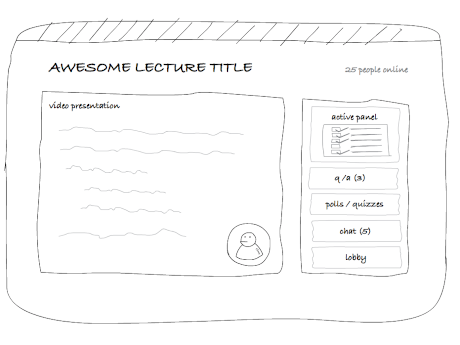

# polylog - a bootcamp capstone project
---
Welcome to polylog, a live online video classroom that enables you to scale your cohorts.

## the problem
Traditional lecture style delivery is not well suited for online learning.
* Cohort sizes are limited by current video services
* Keeping everyone on track can be challenging
* Monitoring participation is difficult
* Gauging comprehension is difficult
* Measuring progress is difficult
* Improvement opportuntities can be challenging to spot
* Need to innovate to stay competitive

---
## the solution
Keep online learners engaged and participating in your lectures.

* "Here's something fun to start off with..."
* "How is everyone feeling this morning?"
* "Here is where we are in the today's agenda..."
* "Here is the key takeaway..."
* "Let's look at everyone's questions..."
* "Pop quiz time!
* "Let's breakout into groups..."
* "How well did everyone understand what we covered today?"
* Who attended the class?
* Who has been uncomfortable and might need coaching?
* Who has been getting more confident and knowledgeable?
* What lecture content is resonating?
* What lecturing content needs attention?
---
## a napkin

