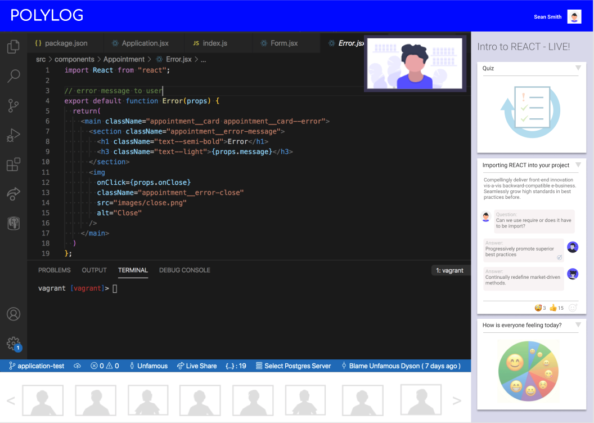

# Solution Concepts
Keep online learners engaged and participating in your lectures by incorporating interactive features such as polls, quizzes, q&a, topic cards and activity feed.

## Scenarios

### "Here's something fun to start off with..."
* Students are asked a fun icebreaker question to get access to the lecture, which announces their arrival in chat.
* Lecturer could include a fun poll to kick-off lecture

### "How is everyone feeling this morning?"
* Lecturer can poll students to select an emoji. Overall results are displayed by participating in the poll; or when a certain % of people have responded; or the lecture chooses to make the poll results visible

### "Here is today's agenda..."
* A card with the lecture's topics in the lecture activity feed

### "Let's talk about this [agenda topic]..."
* A topic card displays the topic in the lecture activity feed.  A topic card features interactive elemements, allowing students to ask a question about the topic, to which other students can reply with answers to other students' questions. Students can emoji the topic card

### "Let's look at everyone's questions..."
* A view which displays all questions and answers from students, which can be upvoted. Questions can be marked as answered.

### "Pop quiz time!"
* A mulitple choice quiz card in the activity feed. Results are displayed by participating in the poll; or when a certain % of people have responded; or the lecture chooses to make the poll results visible

### "Let's breakout into groups..."
* Students can automatically be placed into smaller groups for breakouts and return to the main lecture when a certain time has passed or the lecturer recalls the breakout groups

### "How well did everyone understand what we covered today?"
* A poll to gauge peoples' sense of understanding and feelings on the lecture

---

### Reporting will help answer these questions:
* Who attended the lecture?
* Who has been uncomfortable and might need coaching?
* Who has been getting more confident and knowledgeable?
* What lecture content is resonating?
* What lecture content needs attention?

---
## Design Concept
